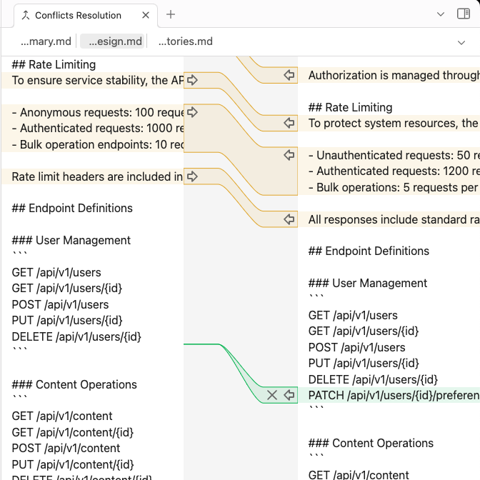
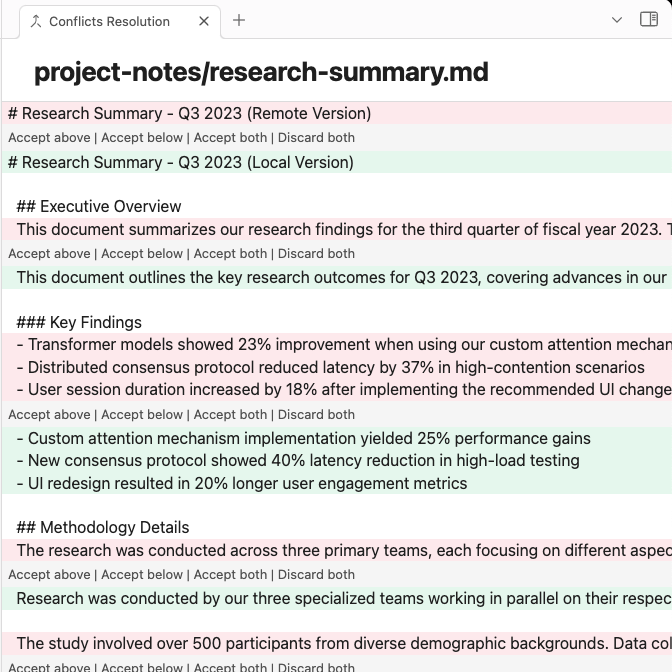

I've been working on this Obsidian plugin for quite some time and I'm really happy to say that it's finally been included in the list of community plugins!

You can find the sources and the install instructions in my GitHub profile over [here](https://github.com/silvanocerza/github-gitless-sync/tree/main). But let's delve a bit into how I came up with the idea for the plugin.

---

If you have never heard of [Obsidian](https://obsidian.md/) it's a desktop and mobile note taking app that you can extend with plugins written in Typescript. It's completely free and gained quite some popularity in the past years because of the [philosophy behind it](https://help.obsidian.md/obsidian).
## Why create a plugin?

I started working on this plugin at the start of January. At the time I recently finished reworking my blog from using [Hugo](https://gohugo.io/) to a custom solution — I'll talk about this in another blog post — so I needed an easy way to sync my Obsidian vault with a GitHub repository.

All my blog content is hosted in the [`blog-sources` repo](https://github.com/silvanocerza/blog-sources) as Markdown files; even though I work every day with an IDE I didn't want to use one to edit my blog sources. Mainly because I don't find that comfortable editing prose with an IDE, and also because I wanted to edit my blog whenever and wherever I wanted, without the need of a desktop at hand.

Since I was using Obsidian more and more for note taking, both desktop and mobile, and love the high customisability of the product I wanted to leverage it to edit my blog content too. So I started to search for existing solutions to sync Obsidian with GitHub, though I didn't like what I found.

## State of the art

There are obviously other people that had a similar idea and leverage Obsidian for their blog, though most of them relied on custom Bash scripts to push their vaults to GitHub. This wasn't good for me as it's not multi platform and I couldn't run a Bash script that easily on my iPhone. Also I wanted the sync action to be simple, just the click of a button, no need to run this or that script depending on your state. 

So I looked around for existing community plugins, I actually found them. The first I stumbled upon was [`Obsidian-GitHub-Sync`](https://github.com/kevinmkchin/Obsidian-GitHub-Sync), it relies on having the Git executable installed in the system. It builds the Git command internally and then executes it, that's fine for desktop though it doesn't support mobile obviously.

The most famous and used instead is [`obsidian-git`](https://github.com/Vinzent03/obsidian-git), it's a more advanced plugin that integrates Obsidian with Git in a deeper way. It lets you see the history, commits, diffs, manage branches, and all the other cool things you can do with Git. This one too relies on Git being installed in the system, on mobile it relies on [`isomorphic-git`](https://isomorphic-git.org/) instead, that's a pure JS reimplementation of Git, but it's experimental and not that reliable.

So since I wanted something really simple without all the advanced Git features, and a solution that would work the same way on desktop and mobile I decided to try and solve the problem from a different direction.

## Git without Git

Git was at the same time the most useful thing and most annoying thing. I wanted to to be able to manage a GitHub repository without the need of the Git executable, this lead me to explore the GitHub REST API documentation and find [this page](https://docs.github.com/en/rest/guides/using-the-rest-api-to-interact-with-your-git-database). 

That's huge! I can access and edit a repository Git database from their REST API, it gives me what could be considered a plumbing interface. Git has [two main interfaces](https://git-scm.com/book/en/v2/Git-Internals-Plumbing-and-Porcelain), porcelain, the shiny high level commands that most people use, and plumbing, the gritty commands that let you access the lower level internals.

I've been using Git via the command line since more than 10 years, I know my way around blobs, commits, reflogs and the lower level interface. This experience mainly comes from the numerous mistakes I made with Git, but that's how most people learnt the lower level parts I bet. You mess your repo in the most absurd way and then try to find a solution. But let's go back to the plugin.

With those endpoints to the Git database I could create my own "porcelain" in a way, this also means that I don't need a Git executable in the system that's running my plugin. All I need is being able to run HTTP requests, and that's what I've done. I would consider my [`SyncManager` class](https://github.com/silvanocerza/github-gitless-sync/blob/main/src/sync-manager.ts) a sort of porcelain interface, it let's me run all the necessary operations to sync remote and local files with some "simple" commands.

There are some downsides to this approach obviously. Main one is that it's closely tied to GitHub, I can't sync my vault with GitLab, Gitea, or other Git hosting services. For the time being this is not a huge issue for me because of the way I use the plugin, though this kind of lock-in might not be something that every user will be happy with. I don't rule out adding support for other hosting services in the future, though it all depends whether they support similar REST APIs.

It's also limited by the capabilities of the API, mainly by the [get tree endpoint](https://docs.github.com/en/rest/git/trees?apiVersion=2022-11-28#get-a-tree), as the `tree` array field in its response is limited to 100000 entries with a maximum size of 7 MB, this when using the `recursive` parameter that I extensively use. Though this can be worked around by making more requests to retrieve the repository content folder by folder if it becomes an issue in the future. That's going to be slower obviously since it will require more requests, but at least it will support bigger vaults.

Another big issue was syncing multiple vaults with the same remote repository. Think of different vault as two different persons working on the same project and the same branch, if one pushes a change the other must first pull the change and then push their change. Though with Git it's "easier" to handle since you have more advanced functionalities to work with, my plugin has just a button so you need a way to handle these cases.

## Conflict resolution

I wanted to give the user the possibility to see the conflicts a sync would cause and give them a way to resolve them. Automatic resolution is not good in my opinion, mainly because I'm scared of making wrong assumptions and resolve it in a way that loses data. I still give the user the chance to automatically resolve conflicts by always overwriting remote or local files, but that's a choice the user must consciously made, by default I always ask the user how to solve a conflict.

So I needed an interface to let the user visualise the sync conflicts. I used Meld for years, I think it's one of the most intuitive interface to resolve conflicts, it can clearly be understood by anyone. So I decided to build something similar. 

Obsidian offers [some APIs](https://docs.obsidian.md/Plugins/User+interface/HTML+elements) to create simple interfaces to create and add HTML elements in the UI. It's certainly useful to build simple interfaces, in fact I used it for my settings page, though it's not the best for complex UIs like the one I wanted to create. They actually know this and have simple guides in their developers documentation to use [React](https://docs.obsidian.md/Plugins/Getting+started/Use+React+in+your+plugin) or [Svelte](https://docs.obsidian.md/Plugins/Getting+started/Use+Svelte+in+your+plugin), my choice fell on React as I'm more experienced with that. So I started building the interface.

Luckily Obsidian uses the [CodeMirror library](https://codemirror.net/) too, an highly extensible code editor, so I didn't even need to chose an editor library for my conflicts resolution view. The documentation is really well written and contains lots of information, that was especially useful when trying to fix the code generated by Claude. The library has been around since mid 2018 and the latest major version has been released 3 years ago, so models have been trained with a LOT of code from old versions, that caused some frustrations when trying to understand which features where available to me.

In the end I managed to make it work like a wanted and created this nice split view. If you ever used Meld or an editor from IntelliJ this will look familiar for sure. It lets you see at a glance which lines have been modified, which have been added or removed, by pressing buttons you can choose this or that version, or you can directly edit the content.

This works great on desktop and bigger screens, though I wanted this plugin to work nicely on mobile and this interface would have been a nightmare to use on smaller screens. I bet at least once you had to use a UI that was clearly made for desktop and ported to mobile as is, or viceversa, that's terrible UX in my opinion. So I had to create a completely separate view for mobile.

It was clear that I could only have a single editor showing the conflicts so I could leverage as much screen space as I could. This time the my inspiration was the conflict resolution from [Visual Studio Code](https://code.visualstudio.com/docs/sourcecontrol/overview?trk=public_post_comment-text#_merge-conflicts), I'm not a great fan of it but it does the job.

I felt it was important this view should have the same features of the split view, highlighted diffs, buttons to quickly accept or discard changes, and directly editing the content. Simple actions the user can take are especially important on mobile in my opinion, you're already limited by not having a big screen and a keyboard, you shouldn't be limited by functionalities too.

I won't delve much more into the conflicts view, if you're interested in the internal and want to understand more deeply how I implemented them I suggest you take a look at the [code here](https://github.com/silvanocerza/github-gitless-sync/tree/03758866fb687f70ec24735b0be3c40856b2447f/src/views/conflicts-resolution).

## The future

I would consider this the MVP of my plugin, it lets you sync your vaults and handle any conflict that might arise. Now that I released it officially my main goal is adding some feature that the [official sync plugin from Obsidian](https://obsidian.md/sync) has. Selective sync, so you ignore certain folders or file types, and file history, so you can see how a file changed over time and rollback to an old version if necessary.

Though this is for the future, I spent quite some time on this and I'd like to work on some other projects of mine for a bit before coming back to those features. Obviously bug fixing and other maintenance work will still be done.

In the end I'm happy that I created something that's useful for me and also for other people, I already received great feedback and lots of curiosity from the community before even releasing it. It was also really fun to work on the project, I had to tackle some problems that I never stumbled upon and learned something new.