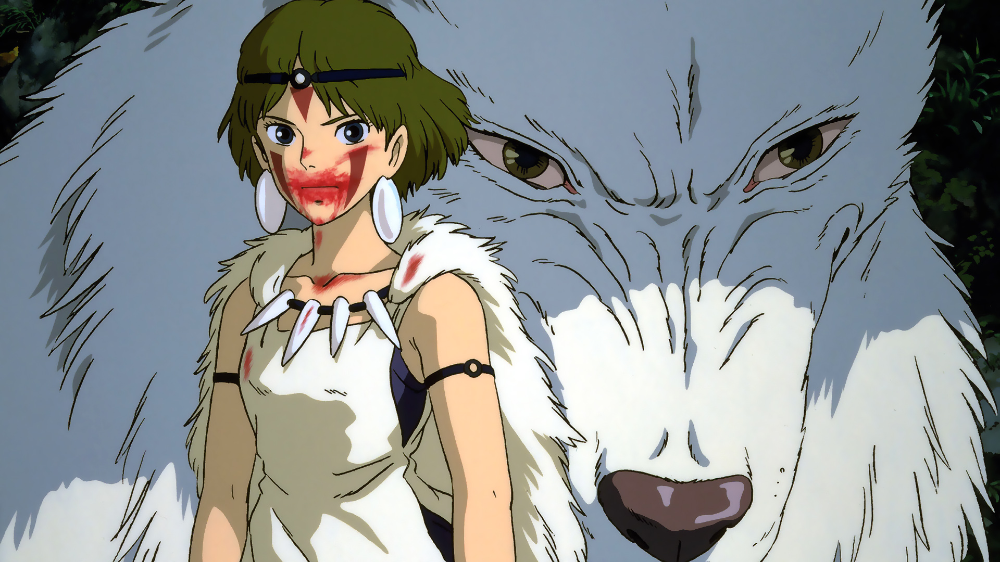

I started writing this as a simple though, it quickly evolved into a rant of sort.

These past week OpenAI released their new image generation model, indeed amazing stuff, it can create and reason about images in way that classic diffusion models really can't.

Quickly people started generating slop upon slop of Studio Ghibli styled images. 

---

All my socials where flooded with these images. Instagram was full of memes but Ghibli style basically adding no content to that. People were sharing their memories Ghibli style, again, adding no substance to those memories. 

LinkedIn was a completely different beast, every single post had a Ghibli style image, even if it wasn't even relevant. This can probably just be my feed since I also work in the field, so I'm connected and following lots of people that create product for and with AI.

I want to focus a bit on LinkedIn because that's mainly the cause of this writing. Again since I'm in the field I'm connected to lots of founders, engineers, and "creators" that do the same, they work every day on some AI related project or product.

I use those tools every day too, mainly to help me be faster writing code, though what bothers me is not simply their use but the way they're used by some people. I see entire profiles sharing posts or articles with only AI generated images. Every. Single. Post. 

I'm not talking about random people either, I'm talking company founders, people that spend their full time creating "disruptive" products they're selling to people. People that are VC funded, that got seeds round in the millions, people that are trying to create something new to break the market, people that want to break industries in a fundamental way.

Those people are sharing the Ghibli styled slop. 

This made me think deeply about their actions and how it affects the world around them too. How can they build something disruptive, something completely new, something that will shake existing industries if they can't even bother with sharing original images with their writings. Are they even writing what they're sharing? 

Is they're writing actually theirs? Writing is an amazing tool for me, it helps me reason about problems by putting things in order, it helps me share with thoughts with other people. It means me to a lot because I believe in what I write, everything you're reading here has been thought and written by me. 

I do use AI though, as an editor and a final proofreader. English is not my main language, I make mistakes some times, so it's good to have a kind of editors that might find this or that grammatical error. But that's it, the rest is all mine.

I don't often use generated images for a post cover, the only image I used here is Princess Mononoke because it makes sense to use it in this case. It enhances the narrative of this post (rant?), it gives more meaning to it, if you've seen the movie and understood it you'll understand what I'm writing too. Hopefully.

This is the important point in my opinion. Are those generated slop images enhancing the content or are they making it worse by commoditising, thus lowering the value, of it?

Is content really worth if you didn't create it?

I'm also wondering how on Earth people are pouring so much money and trust on founders that claim to be able to change everything if they can't even manage to create something new for a stupid post on their main communication channel?

I'm tired of ranting for now.