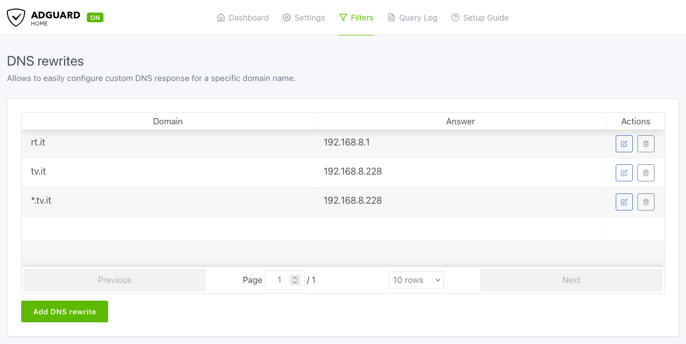
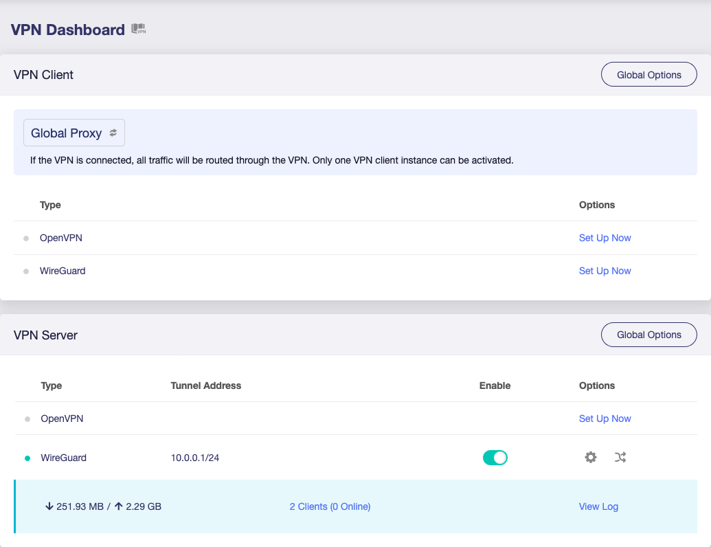

I have a small PC at home that I use as a server to run some [personal services](https://github.com/silvanocerza/personal-services) of mine, Jellyfin, Sonarr, QBitTorrent, and others. This is an outline of the current setup and some of the problems I faced.

---

One of the things that always bothered me about running a server in my network is having to use the IP and port to access this or that service. So when I first set everything up, I had to find a solution to access each service using a different URL. After some searching and thinking I came up with a solution that satisfies me quite nicely.
# Equipment

I'm using a [Flint 2](https://www.gl-inet.com/products/gl-mt6000/) as my router, this gives me the chance to do some funky stuff in my network. It can easily run [AdGuard Home](https://adguard.com/en/adguard-home/overview.html) to filter ads network wide, since it acts as a DNS server I can also rewrite some DNS queries. I can also run a [WireGuard](https://www.wireguard.com/) server and/or client with ease, this is especially helpful to access my LAN when not at home.

The actual server is a [Minisforum NAB6](https://www.minisforum.com/products/minisforum-nab6-nab9-nab6-lite-nab7-amz?variant=49516388778290) with an Intel i7-12650H CPU, 32GB RAM and 1 TB SSD. It's small enough that can fit anywhere, and powerful enough to handle 4K movies and multiple containers at the same time. It also has a couple of 2.5G ethernet ports, enough USB ports to plug extra peripherals like a Zigbee antenna, or extra storage. It was also quite cheap at around 500 Euro.

This is all the hardware I use to manage efficiently my LAN.
# Domains

I find it EXTREMELY annoying having to write the server IP every time I want to access it, so my top priority was using a custom domain.

This is where AdGuard becomes really useful. Since it's a DNS server and I can define custom DNS rewrites with just a couple of clicks, every DNS query that exists through my LAN will first pass through AdGuard and will be rewritten if it matches any domain I'm interested in.



I decided to use two different domains, `rt.it` to access my router directly, and `tv.it` to access the server. I picked those for two main reasons:
- they're fast and easy to type
- they're not assignable

Some backstory might be helpful here.

By chance I found out that every two characters domain in the `.it` ccTLD is non-registrable. If I use any of those for my LAN I'll never risk that domain clashing with a domain registered by someone else. I could have used my `silvanocerza.com` domain to be fair, but I wanted a short one that I could type quickly.

Since `.it` is a ccTLD, Registro.it, the Italian national organisation responsible for assignment and management of the `.it` ccTLD domains, decided to completely ban registration for two letter domain between 1999 and 2000. This was done probably to protect geographic domains for Italian provinces, think `.mi.it` for Milan, `.rm.it` for Rome, etc.

Though there is two-letter `.it` domain in the wild. The company bought it early in the 1996 and still uses it, that is [q8.it](https://q8.it), owned obviously by Q8, the oil company. I wonder what would happen if they ever forget to renew their registration. 

Some people might wrinkle their nose at this choice. Why not use one of the [reserved TLDs](https://en.wikipedia.org/wiki/Top-level_domain#Reserved_domains) like `.local` or `.internal`? I indeed took them into consideration, but all of them are quite long, and I want a short URL. The only usable one would have been `.internal` as all the others have actual uses, `.local` is used for mDNS as an example.

All in all the choice I made works for the time being as I know it won't cause any clashes. This also ties really nicely with the way I set up my services.
# Services

To run my services I decided to have a bunch of Docker compose files, each named after the service it defines. So Sonarr will be in `sonarr.yml`, QBitTorrent will be `qbittorrent.yml` and so on.

Since I have multiple services on my server I need to route different requests to different containers, to do this I decided to use [Traefik](https://doc.traefik.io/traefik/) as an Application Proxy. It's easy to configure and adding new containers doesn't require any change in its configs. The configuration required is also pretty minimal.

```traefik.yml
services:
  traefik:
    image: "traefik:v3.2"
    container_name: "traefik"
    command:
      - "--api.insecure=true"
      - "--providers.docker=true"
      - "--providers.docker.exposedbydefault=false"
      - "--entryPoints.web.address=:80"
    ports:
      - "80:80"
      - "8080:8080"
    volumes:
      - "/var/run/docker.sock:/var/run/docker.sock:ro"
    networks:
      - traefik-net

networks:
  traefik-net:
    name: traefik-net
```

As you can see I don't expose all containers by default using the `--providers.docker.exposedbydefault=false` command. I do this since I'm also running services that don't need to be accessible from the network but act as support to the others. 

Like [Watchtower](https://containrrr.dev/watchtower/), which automatically updates the containers base images.

```watchtower.yml
services:
  watchtower:
    image: "containrrr/watchtower"
    container_name: "watchtower"
    environment:
      - TZ=${TIMEZONE:-Etc/UTC}
      - WATCHTOWER_HTTP_API_TOKEN=${WATCHTOWER_API_TOKEN?error}
    command:
      - "--cleanup"
      - "--http-api-metrics"
    ports:
      - "8082:8080"
    volumes:
      - "/var/run/docker.sock:/var/run/docker.sock"
```

Since it doesn't need to be accessible from LAN I don't even set the network to `traefik-net`. Notice though I had to expose the host's Docker socket to both. Traefik needs that to listen Docker events in case new containers are added to its network, see how it's read-only since it just needs to listen. Watchtower instead needs write access too as it needs to update running containers.

In here, and all other services too, I'm also using [Docker Variable Interpolation](https://docs.docker.com/compose/how-tos/environment-variables/variable-interpolation/) to manage secrets and variables that I keep in a `.env` file ignored by Git. This way I can easily share all my services definitions without leaking anything.

A typical service that is accessible from LAN instead will look quite different from the ones above, this is the one for Sonarr.
```sonarr.yml
services:
  sonarr:
    image: lscr.io/linuxserver/sonarr:latest
    container_name: sonarr
    environment:
      - PUID=${PUID?error}
      - PGID=${PGID?error}
      - UMASK=${UMASK?error}
      - TZ=${TIMEZONE:-Etc/UTC}
    ports:
      - "8989:8989"
    volumes:
      - "${COMMON_STORAGE?error}/config/sonarr:/config"
      - "${COMMON_STORAGE?error}/data:/data"
    labels:
      - "traefik.enable=true"
      - "traefik.http.routers.sonarr.rule=Host(`sonarr.${MAIN_ENDPOINT?error}`)"
      - "traefik.http.routers.sonarr.entrypoints=web"
      - "traefik.http.services.sonarr.loadbalancer.server.port=8989"
      - "traefik.docker.network=traefik-net"
    restart: unless-stopped
    networks:
      - traefik-net

networks:
  traefik-net:
    external: true
```

For most of my services I use the images created by the amazing people at [linuxserver.io](https://www.linuxserver.io/), they really do an amazing job maintaining all that.

Some services need to store configs and other data, I keep that in a common directory in my server that I set with the `COMMON_STORAGE` variable. I do this because it makes it easy to edit configs if there needs be, but also because this way I don't lose them when I destroy a container.

The key part to expose the service to the LAN is the `labels` and `networks` fields. 

Since I don't expose any service by default I need to set `traefik.enable=true` to let Traefik know that it can "use" the container.

The ``traefik.http.routers.sonarr.rule=Host(`sonarr.${MAIN_ENDPOINT?error}`)``
 is the most important label, this is the rule that tell Traefik when it must route requests to this container. In this case when it matches `sonarr.tv.it`. I used a variable here in case I want to easily change my domain in the future. There are obviously different [rules supported](https://doc.traefik.io/traefik/routing/routers/#rule), but this does the job for me.

If we're not explicit on which entrypoints the service should receive connections from it will use all the Traefik's default ones. With `traefik.http.routers.sonarr.entrypoints=web` we define only the `web` one that receives requests from port `80`, that is the port for HTTP.

By default no service ports are exposed to Traefik, so we must declare which one to use with `traefik.http.services.sonarr.loadbalancer.server.port=8989`. This matches the `ports` settings usually.

`traefik.docker.network=traefik-net` shouldn't be necessary as it overrides the default network for that container, but I like to be explicit so I set in any case. If the container belongs to multiple networks this becomes necessary otherwise it will pick a random one and could cause routing issues.

This is just one of the services I defined, to see more examples checkout [this repo](https://github.com/silvanocerza/personal-services).

# Outside access

Obviously these services become really useful when I can access them wherever I am, even though I'm mostly at home. So I needed some way to made the LAN available from my mobile devices, mainly my iPhone and MacBook.

There are obviously many different solutions, [Cloudflare Access](https://www.cloudflare.com/zero-trust/products/access/), [ngrok](https://ngrok.com/), or [Tailscale](https://tailscale.com/), to name a few. Though I didn't want to rely on a third party, even with a free tier available, as they like to move the goalposts and didn't want to risk having to change my setup at a moment's notice cause of the will of a random company.

As I said above my router can run both a WireGuard server and client with no issue so I decided to use that, I just have a couple of devices to configure so that didn't take much time. GL.iNet also provides some [nice guides](https://docs.gl-inet.com/router/en/4/tutorials/wireguard_server_access_to_client_lan_side/) to help you setup everything if you're not sure on the correct path.



A cool thing of this approach is that if in the future I want to build my own private VPN that exits from nodes around the world I can. I'll have to get some machines from AWS, GCP or Azure — probably not lol — scattered around the world and use them as WireGuard servers, while my Flint 2 acts as a single client. For the time being I can rely on existing VPNs if necessary.

The annoying thing though, is that I must use a static IP. I took into consideration [Dynamic DNS](https://en.wikipedia.org/wiki/Dynamic_DNS) but I'm under that beautiful thing that is [CGNAT](https://en.wikipedia.org/wiki/Carrier-grade_NAT) so it doesn't work reliably with WireGuard and I was forced to use a static IP. Luckily the process to ask for one from my ISP is automated and took no time to do so. The main downside is that now I need to be careful not to leak it, because probably it's a pain in the ass to change it.
# SSL

You might have noticed I never mentioned SSL anywhere, simply because I'm not using it. All the services are accessible only if you have access to my LAN, so I feel comfortable doing without SSL in this case. If you already have access to my LAN I'm already done for in any case.

There's also the issue of generating certificates for the domains I'm using, since they're non registrable I can't create a certificate for them. It would also force me to expose parts of my LAN to the web to complete Let's Encrypt challenges.

It's obviously feasible to create SSL certificates for your LAN but that requires some extra work that I don't want to bother with, so for the time being I decided to ignore this. If in the future I'll need to expose some services I'll probably use my domain `silvanocerza.com` to make them available.

# Home Assistant problems

Recently I also added [Home Assistant](https://www.home-assistant.io/) to my services, since it likes to run using the host network I had some issues routing requests to its container with Traefik and it required some extra care.

When you configure a service with `network_mode: host` you can't set any other network for that service. I tried doing without `network_mode: host` and keep the Home Assistant container in the Traefik network but it was giving me way too many problems: some integrations wouldn't work at all, devices wouldn't be easily accessible, etc. 

Keeping a container in the Traefik network is what makes it accessible with a custom domain though, so it was quite of a problem having Home Assistant on a separate network. After some experimenting I found a solution that works quite nicely, it just requires an extra container running Nginx.

```home-assistant.yml
services:
  home-assistant:
    image: lscr.io/linuxserver/homeassistant:latest
    container_name: home-assistant
    environment:
      - PUID=${PUID?error}
      - PGID=${PGID?error}
      - TZ=${TIMEZONE:-Etc/UTC}
    volumes:
      - ${COMMON_STORAGE?error}/config/home-assistant:/config
    restart: unless-stopped
    privileged: true
    network_mode: "host"

  home-assistant-proxy:
    image: nginx:alpine
    container_name: home-assistant-proxy
    volumes:
      - ./nginx.conf:/etc/nginx/conf.d/default.conf
    networks:
      - traefik-net
    extra_hosts:
      - "host.docker.internal:host-gateway"
    labels:
      - "traefik.enable=true"
      - "traefik.http.routers.home-assistant.rule=Host(`home.${MAIN_ENDPOINT?error}`)"
      - "traefik.http.routers.home-assistant.entrypoints=web"
      - "traefik.http.services.home-assistant.loadbalancer.server.port=80"
      - "traefik.docker.network=traefik-net"

networks:
  traefik-net:
    external: true
```

This is what I came up with, Home Assistant running in its own container using the host network, while Nginx runs on a separate container that is part of Traefik's network. The labels are similar to the ones used by other services, though they're set on the proxy instead of the actual service. The main difference is the `extra_hosts` field, that is what makes Nginx able to route to Home Assistant as it gives it access to the Docker's host network. That is in turn used in the `nginx.conf` defined as follow.

```nginx.conf
server {
    listen 80;

    location / {
        proxy_pass http://host.docker.internal:8123;

        # Essential headers for proper proxying
        proxy_set_header Host $host;
        proxy_set_header X-Real-IP $remote_addr;
        proxy_set_header X-Forwarded-For $proxy_add_x_forwarded_for;
        proxy_set_header X-Forwarded-Proto $scheme;

        # WebSocket support (needed for Home Assistant)
        proxy_http_version 1.1;
        proxy_set_header Upgrade $http_upgrade;
        proxy_set_header Connection "Upgrade";

        # Longer timeouts for long-lived connections
        proxy_read_timeout 90s;
        proxy_connect_timeout 90s;
        proxy_send_timeout 90s;

        # Disable buffering for event streams
        proxy_buffering off;
    }
}
```

This is a pretty minimal setup for Nginx with some extras for Home Assistant but it does the trick and solve the routing issue. Between the different possible solutions that I took into consideration, like using only the network hosts for all my services, this is the one that seems the cleanest and satisfies me the most.

# Future improvements

This is the current setup, though I already have some ideas to improve it. 

As of now to add a new service I need to write a Docker compose file, but I'd like to have some kind of interface to automate that. I'm thinking of creating a service with a web UI that lets me do that. Ideally it can also double as a monitoring dashboard for all the services, where I can jump to this or that service with just a click. 

There are similar solutions like [Docker Dashboard](https://dockerdashboard.github.io/), [Dashy](https://dashy.to/), and [Homepage](https://gethomepage.dev/), that I'm currently using, but their customisation require editing lots of config file that I don't really want to bother with, or their use case doesn't completely fills my needs. And in the end I'd like to have some fun trying to create something similar.

Though the most urgent improvement I need to focus on is the hardware, I need more storage with some failsafes. The current plan is to get an Hard Disk bay and use it as Direct Attached Storage to my server. I don't need a NAS, the server is already connected to the network and I don't want to manage a separate server for that. 

In the hardware department I should a get UPS too, it's never fun if there are network outages when you're not at home and can't turn things back on because of that.

In any case this isn't even its final form, I'll keep posting updates when I improve the setup or stumble upon any issue.